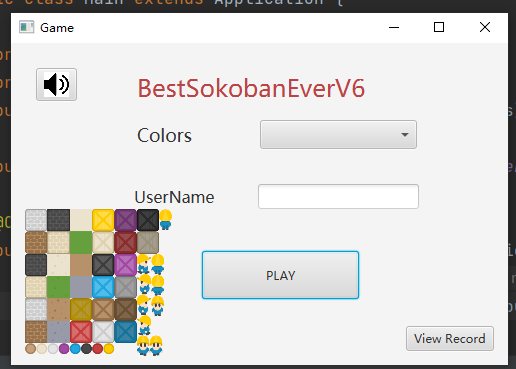
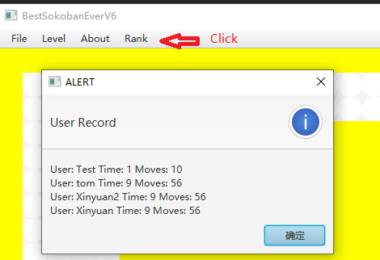
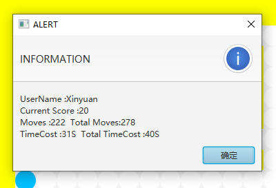
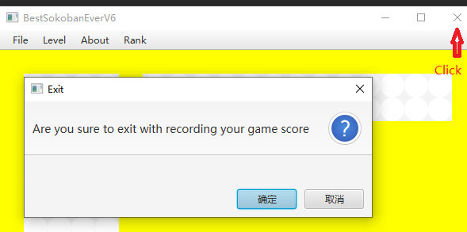

## Project info

@author    *Xinyuan Zuo*

@User Name    *ezyxz*

@student ID  *14342968*

@GitLab URL https://projects.cs.nott.ac.uk/ezyxz/comp2013_ezyxz

### How to run the project

* Unzip Project, Open intellij idea -> Open Project -> Wait for install Maven dependency (Or select Maven Reload Maven Project)
* Then find Main.java run it
* If meet some error, please rebuild project

### Key changes

#### Addition

* START screen    [Location:java file](/src/main/java/sample/scene/Main.java)



* Level Record (This is additional feature)    [Location:java file](/src/main/java/sample/controller/Controller.java)

  * When the player passes a level, he will get 1 level points
  * Nothing to do with time and moves
  * When player close the game, it will remind if record his level  he got 0

* UserName Input and record   [Location:java file](/src/main/java/sample/controller/Controller.java)

* Background color select (8 options)  [Location:java file](/src/main/java/sample/controller/Controller.java)

* Background Music Switch adjustment  [Location:java file](/src/main/java/sample/controller/Controller.java)

* Player's time and moves record (automatically in top 10)  [Location:java file](/src/main/java/sample/dataoperation/UserStatistic.java)

* View the current level top 10 [Location:java file](/src/main/java/sample/scene/APP.java)

  

* Auto prompt message  [Location:java file](/src/main/java/sample/scene/APP.java)

  


* Close the window to prompt whether to save the score [Location:java file](/src/main/java/sample/scene/APP.java)

  

  

#### Refactoring

* Build files by MVC pattern 

* Build files by Maven

* Classes into different packages

* [Junit Test](/src/test/java/UserRecordTest.java)

  ```text
  In order to make the project more clear and developers can find the java files that need to be modified faster, divide the entire project into five packages: button stress(controller), data record update(dataoperation), scene loading(scene), ui background loading(ui), and data loading(load).
  ```
  
  * sample.controller  [Location](/src/main/java/sample/controller)
  * sample.dataoperation  [Location](/src/main/java/sample/dataoperation)
  * sample.load  [Location](/src/main/java/sample/load)
  * sample.scene  [Location](/src/main/java/sample/scene)
  * sample.ui  [Location](/src/main/java/sample/ui)
  
* resources\img  [Location](/src/main/resources/img)
  * resources\level  [Location](/src/main/resources/level)
  * resources\sample.scene  [Location](/src/main/resources/sample/scene)
  
  
  
### Document

* [Javadoc](/javadoc)
* [Design.png](/Design.png)
* [Video](/zuoXinyuanDemo.mp4)

### New Class

* Controller

* UserStatistic

* ScoreRecord

* APP

* Main

* BackgroundColor

### Modified Class

* GameLogger

* GameEngine

* GameObject

* Level

* GameGrid

* GraphicObject

  


